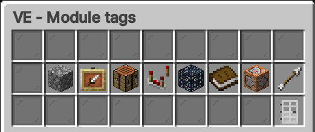
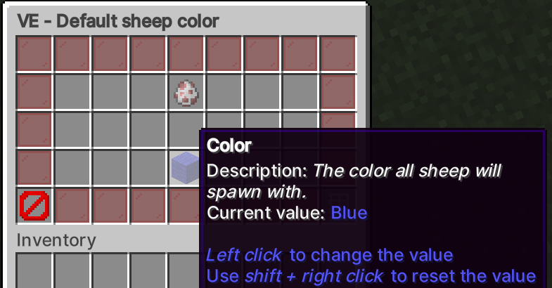
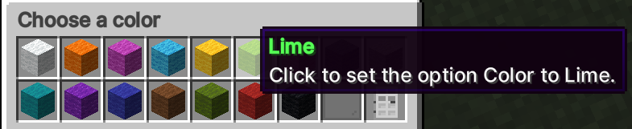
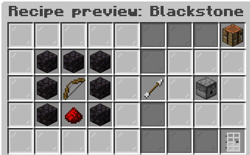
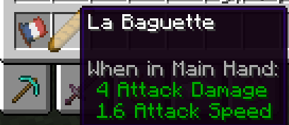
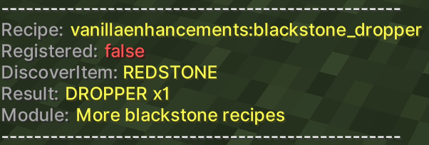

# VanillaEnhancements

[Documentation](https://sehrschlechtyt.github.io/VE-Docs/docs)  

A collection of enhancements for the vanilla minecraft gameplay (on spigot servers).  
Some modules are taken from the [vanilla tweaks](https://vanillatweaks.net) data packs and crafting tweaks.

## Requirements

### Paper
Use Paper 1.20 or higher for the best experience and compatibility. Various features are not available on Spigot.

### Spigot
There is partial 1.19 support for spigot, however use it with caution. 1.20 is recommended.

## Core Features

### Users

* Lots of enhancements for the vanilla gameplay
* Ingame Configuration GUI
* Fully translatable
* Various extensions, such as a resource pack server

### Developers

* Fully modularized structure
* Extensive API for adding your own modules
* Custom Items API with an automatic resource pack builder (custom blocks/entities are planned for the future)
* Simple to use configuration API
* Extensive debugging features
* Automatic docs generator plugin that creates markdown files for modules (see the output at https://github.com/sehrschlechtYT/VE-Docs)

## Screenshots

### Config GUI

### Custom Items

  
*Yes, this is how the item is supposed to look like.*

### Dev features

